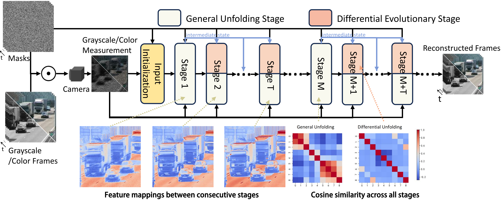
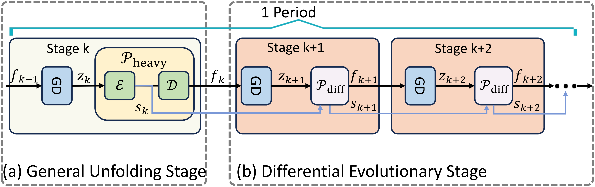
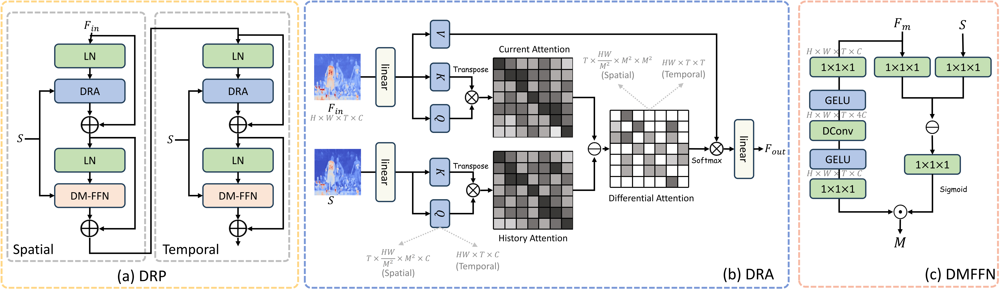

<div align="center">

<h1>
Differential Unfolding: Efficient Unfolding Reconstruction for Video Snapshot Compressive Imaging
</h1>

<p>
Muyuan Zhang<sup>1,*</sup>, Jiancheng Zhang<sup>1,*</sup>, Haijin Zeng<sup>2</sup>, Yin-ping Zhao<sup>1,†</sup>
</p>

<p>
<sup>1</sup> Northwestern Polytechnical University, Xi'an, China &nbsp;&nbsp;
<sup>2</sup> Harbin Institute of Technology (Shenzhen), Shenzhen, China <br>
(*Equal contribution, †Corresponding author)
</p>

[](https://arxiv.org/pdf/2606.24153)
[](https://drive.google.com/drive/folders/1vYmSZGCZZBDilsrvecskW_esc3XwtnUh?usp=sharing)
[](LICENSE)

</div>

---

Official PyTorch implementation of **Differential Unfolding (DU): Efficient Unfolding Reconstruction for Video Snapshot Compressive Imaging**.

## TABLE OF CONTENTS
1. [Highlights](#highlights)
2. [Visual Results](#visual-results)
3. [Installation](#installation)
4. [Datasets and Pre-trained Models](#datasets-and-pre-trained-models)
5. [Quick Start: Testing](#quick-start-testing)
6. [Training](#training)
7. [Results](#results)
8. [Citation](#citation)
9. [Acknowledgement](#acknowledgement)
10. [License](#license)

---

## Highlights

<p align="center" width="80%">

</p>
<p align="center" width="80%">

</p>
<p align="center" width="80%">

</p>

1.  **Inter-Stage Representation Homogeneity:** We identify that conventional Deep Unfolding Networks (DUNs) repeatedly apply identical, high-complexity prior networks at every stage, even though the reconstruction trajectory converges toward static states. This causes stage-wise feature representations to become highly similar, wasting computation on minimal updates.
2.  **Differential Evolutionary Framework (DEF):** DU breaks this homogeneity by partitioning the unfolding process into periodic **general unfolding stages** (high-parameter spatial-temporal backbones for holistic feature reconstruction) and **differential evolutionary stages** (lightweight refinement of inter-stage variations).
3.  **Differential Representation Prior (DRP):** A lightweight prior used in differential stages, composed of **Differential Representation Attention (DRA)**, which amplifies attention to regions that changed across stages while suppressing redundant ones, and a **Differential Modulated FFN (DM-FFN)**, which rectifies features via difference-driven pixel-level gating.
4.  **SOTA Accuracy-Efficiency Trade-off:** On 6 grayscale benchmarks, DU-9stg achieves **37.57 dB** average PSNR while using only **50.2%** of the parameters and **25.12%** of the FLOPs of the previous best deep-unfolding method (DADUN).

---

## Visual Results

### Results on Grayscale Simulation Videos
DU reconstructs sharper edges and finer details than prior Transformer-based and deep-unfolding methods, with substantially fewer parameters and FLOPs.
<p align="center" width="100%">

</p>

### Results on Color Simulation Videos
<p align="center" width="100%">

</p>


---

## Installation

1.  Clone this repository:
    ```bash
    git clone https://github.com/MuyuanZhang/DU.git
    cd DU
    ```

2.  Create and activate a virtual environment (e.g., using conda):
    ```bash
    conda create -n du python=3.10
    conda activate du
    ```

3.  Install PyTorch (choose the build matching your CUDA version) and the remaining dependencies:
    ```bash
    pip install torch torchvision
    pip install -r requirements.txt
    ```

---

## Datasets and Pre-trained Models

### 1. Training Data

DU is trained on the **DAVIS 2017** dataset following the same protocol as EfficientSCI/HiSViT. Download the dataset and point `data_root` in [`configs/_base_/davis.py`](configs/_base_/davis.py) to your local `DAVIS/JPEGImages/480p` directory:

```python
train_data = dict(
    type="DavisData",
    data_root="/path/to/DAVIS/JPEGImages/480p",
    ...
)
```

### 2. Test Data

Simulation test sequences (grayscale: `kobe`, `traffic`, `runner`, `drop`, `crash`, `aerial`) and masks are already provided under [`test_datasets/`](test_datasets/):

```
└── 📁test_datasets
    ├── 📁mask
    │   ├── gray_mask.mat
    │   ├── color_mask.mat
    │   └── real_mask.mat
    ├── 📁simulation
    │   ├── kobe_cacti.mat
    │   ├── traffic_cacti.mat
    │   ├── runner8_cacti.mat
    │   ├── drop8_cacti.mat
    │   ├── crash32_cacti.mat
    │   └── aerial32_cacti.mat
    └── color_mask.mat
```

For color datasets and real captured data evaluation (Duomino, WaterBalloon), refer to the dataset release used by prior video-SCI works (EfficientSCI).

### 3. Pre-trained Models

We provide checkpoints for both model sizes, on grayscale and color benchmarks. Download and place them under `checkpoint/`:

| Model | Setting | Params (M) | FLOPs (G) | PSNR (dB) | Checkpoint |
|---|---|---|---|---|---|
| DU-5stg (gray) | 5 stages | 3.95 | 899.64 | 37.10 | `checkpoint/gray_5stg.pth` |
| DU-9stg (gray) | 9 stages | 6.36 | 1574.37 | 37.57 | `checkpoint/gray_9stg.pth` |
| DU-9stg (color) | 9 stages | 6.36 | 6298.62 | 38.30 | `checkpoint/color_9stg.pth` |

- **Download Link:** [Google Drive](https://drive.google.com/drive/folders/1vYmSZGCZZBDilsrvecskW_esc3XwtnUh?usp=sharing) 

```
└── 📁checkpoint
    ├── gray_5stg.pth
    ├── gray_9stg.pth
    └── color_9stg.pth
```

---

## Quick Start: Testing

Run inference and evaluation (PSNR/SSIM) on the simulation benchmarks using the provided configs and checkpoints:

```bash
# Grayscale, 5-stage model
python Test.py configs/DU/DU_5stg.py --weights checkpoint/gray_5stg.pth

# Grayscale, 9-stage model
python Test.py configs/DU/DU_9stg.py --weights checkpoint/gray_9stg.pth

# Color, 9-stage model
python Test.py configs/DU/DU_9stg_color.py --weights checkpoint/color_9stg.pth
```

Results (reconstructed frames and logs) are saved under `work_dirs/<config_name>/`.


---

## Training

Training follows the standard deep-unfolding pipeline: train end-to-end on DAVIS2017 with a full-stage (exponentially weighted) RMSE loss across all unfolding stages, first at `8×128×128` resolution for 100+ epochs, then fine-tuned at `8×256×256` for 30+ epochs.

```bash
# Grayscale, 5-stage model
python Train.py configs/DU/DU_5stg.py

# Grayscale, 9-stage model
python Train.py configs/DU/DU_9stg.py

# Color, 9-stage model
python Train.py configs/DU/DU_9stg_color.py
```
Checkpoints and logs are written to `work_dirs/<config_name>/`.

---

## Results

### Grayscale Simulation (6 benchmark videos)

| Method | Params (M) | FLOPs (G) | Average PSNR / SSIM |
|---|---|---|---|
| EfficientSCI++ | 8.08 | 1063.01 | 36.44 / 0.975 |
| HiSViT | 8.98 | 1535.92 | 37.00 / 0.978 |
| DADUN | 12.67 | 6266.15 | 37.01 / 0.978 |
| **DU-5stg (Ours)** | **3.95** | **899.64** | 37.10 / 0.978 |
| **DU-9stg (Ours)** | 6.36 | 1574.37 | **37.57 / 0.980** |

### Color Simulation (6 benchmark videos)

| Method | Params (M) | FLOPs (G) | Average PSNR / SSIM |
|---|---|---|---|
| DADUN | 10.44 | 20411.11 | 37.89 / 0.972 |
| HiSViT | 8.98 | 6143.68 | 38.01 / 0.972 |
| **DU-9stg (Ours)** | **6.36** | 6298.62 | **38.30 / 0.974** |


---

## Citation

If you find our work useful for your research, please consider citing our paper:
```bibtex
@misc{zhang2026differentialunfoldingefficientunfolding,
      title={Differential Unfolding: Efficient Unfolding Reconstruction for Video Snapshot Compressive Imaging}, 
      author={Muyuan Zhang and Jiancheng Zhang and Haijin Zeng and Yin-ping Zhao},
      year={2026},
      eprint={2606.24153},
      archivePrefix={arXiv},
      primaryClass={cs.CV},
      url={https://arxiv.org/abs/2606.24153}, 
}
```

---

## Acknowledgement

This project is built upon the excellent work of several open-source projects. We extend our sincere thanks to their authors.

- **[EfficientSCI](https://github.com/ucaswangls/EfficientSCI)**: For the `cacti` data/training/evaluation framework that this codebase is based on.

---

## License

This project is licensed under the **MIT License**. See the [LICENSE](LICENSE) file for details.
